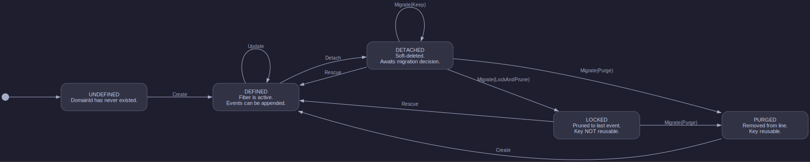

# Pardosa

EDA storage layer implementing [fiber semantics](https://github.com/acje/fiber-semantics) in Rust.

Pardosa enforces event-driven correctness, auditability, and deletion policy for Event Carried State Transfer (ECST). Each domain entity's history is a **fiber** — a singly linked list of immutable events — interleaved into an append-only **line** (dragline). A per-fiber state machine (5 states, 10 transitions) governs the lifecycle: Create, Update, Detach, Rescue for application operations; Migrate(Keep), Migrate(Purge), Migrate(LockAndPrune) for schema upgrades and deletion policies.

Ported from a [Go prototype](https://github.com/acje/web-service-gin) with improvements planned for concurrency, NATS/JetStream persistence, and proper migration support.

## Fiber State Machine

The state machine defines a partial function over S × A → S where |S| = 5, |A| = 7, yielding 35 possible pairs. Only 10 transitions are defined; the remaining 25 are rejected, enforcing lifecycle invariants at the domain boundary.

**Application ops** (between migrations): Create, Update, Detach, Rescue

**Migration ops** (during migration pass): Migrate(Keep), Migrate(Purge), Migrate(LockAndPrune)

See [pardosa.md](pardosa.md) for research notes and design.
