# Architecture Decision Records

This directory contains all ADRs for the cherry-pit event-sourcing framework.

Numbering follows importance-weighted tiers (S → D). Post-1.0,
new ADRs append monotonically — no further renumbering.

## Index

| #    | Title                                    | Tier | Status   | Depends on          |
|------|------------------------------------------|------|----------|---------------------|
| 0001 | Design Priority Ordering                 | S    | Accepted | —                   |
| 0002 | Make Illegal States Unrepresentable      | S    | Accepted | 0001                |
| 0003 | Compile-Time Error Preference            | S    | Accepted | 0001, 0002          |
| 0004 | Event Sourcing + DDD + Hexagonal         | S    | Accepted | 0001                |
| 0005 | Single Aggregate Design                  | S    | Accepted | 0004                |
| 0006 | Single-Writer Assumption                 | S    | Accepted | 0004                |
| 0007 | Forbid Unsafe Code                       | A    | Accepted | 0001                |
| 0008 | Pure Command Handling                    | A    | Accepted | 0004                |
| 0009 | Infallible Apply                         | A    | Accepted | 0004                |
| 0010 | Domain Event Supertrait Bounds           | A    | Accepted | 0004                |
| 0011 | Aggregate ID — NonZero u64               | A    | Accepted | 0006                |
| 0012 | Aggregate Default Zero-State             | A    | Accepted | 0009                |
| 0013 | Create / Send Split                      | B    | Accepted | 0011                |
| 0014 | Commands Not Serializable                | B    | Accepted | 0004                |
| 0015 | Error Type per Command                   | B    | Accepted | 0005                |
| 0016 | Store Created Envelopes                  | B    | Accepted | 0004                |
| 0017 | Policy Output — Static Type              | B    | Accepted | 0005                |
| 0018 | Sync Domain, Async Infrastructure        | B    | Accepted | 0008, 0025          |
| 0019 | Load Returns Empty, Not Error            | B    | Accepted | 0013                |
| 0020 | Infrastructure-Owned Aggregate Identity  | B    | Accepted | 0011, 0013, 0018    |
| 0021 | Non-Exhaustive Errors                    | B    | Accepted | 0015                |
| 0022 | Event Schema Evolution                   | B    | Accepted | 0009, 0010, 0031    |
| 0023 | Aggregate Lifecycle States               | B    | Accepted | 0009, 0013          |
| 0024 | Event Delivery Model                     | B    | Accepted | 0004, 0017          |
| 0025 | RPITIT over async-trait                  | C    | Accepted | 0001                |
| 0026 | Correctness-First Build Config           | C    | Accepted | 0001, 0007          |
| 0027 | Manual Error Impls                       | C    | Accepted | 0001, 0015          |
| 0028 | Compile-Fail Type Contracts              | C    | Accepted | 0005, 0003          |
| 0029 | Cargo Workspace Crate DAG                | C    | Accepted | —                   |
| 0030 | Flat Public API                          | C    | Accepted | 0029                |
| 0031 | MessagePack Named Encoding               | D    | Accepted | —                   |
| 0032 | Atomic File Writes                       | D    | Accepted | 0006                |
| 0033 | UUID v7 Event Identity                   | D    | Accepted | 0006, 0034          |
| 0034 | Jiff Timestamp                           | D    | Accepted | —                   |
| 0035 | Two-Level Concurrency                    | D    | Accepted | 0006, 0032          |
| 0036 | File-Per-Stream Full-Rewrite Storage     | D    | Accepted | 0031, 0032          |
| 0037 | No Snapshot Support                      | D    | Accepted | 0009                |
| 0038 | Testing Strategy                         | C    | Accepted | 0001, 0003, 0028    |
| 0039 | Correlation Context Propagation          | B    | Accepted | 0016, 0004, 0017    |
| 0040 | Saga and Compensation (Deferral)         | B    | Accepted | 0017, 0024, 0039    |
| 0041 | Idempotency Strategy                     | B    | Accepted | 0008, 0017, 0039    |
| 0042 | EventEnvelope Construction Invariants    | A    | Accepted | 0002, 0016, 0039    |
| 0043 | Process-Level File Fencing               | D    | Accepted | 0006                |
| 0044 | Object Store Backend (Planned)           | D    | Proposed | 0004, 0006, 0031    |

## Dependency Graph

```
Tier S — Foundational
  0001 Design Priority Ordering
    ├── 0002 Illegal States
    │     └── 0003 Compile-Time Errors
    ├── 0007 Forbid Unsafe ──► 0026 Build Config
    └── 0025 RPITIT
  0004 Event Sourcing + DDD + Hexagonal
    ├── 0005 Single Aggregate
    │     ├── 0015 Error Type per Command ──► 0021 Non-Exhaustive Errors
    │     │                                └── 0027 Manual Error Impls
    │     ├── 0017 Policy Output ──► 0024 Event Delivery
    │     └── 0028 Compile-Fail Tests
    ├── 0006 Single-Writer
    │     ├── 0011 Aggregate ID ──► 0013 Create/Send ──► 0019 Load Empty
    │     │                                           └── 0020 Infra Identity
    │     ├── 0032 Atomic Writes ──► 0035 Two-Level Concurrency
    │     │                       └── 0036 File-Per-Stream
    │     └── 0033 UUID v7
    ├── 0008 Pure Command ──► 0018 Sync/Async ──► 0020 Infra Identity
    ├── 0009 Infallible Apply ──► 0012 Default Zero-State
    │                          ├── 0022 Schema Evolution
    │                          ├── 0023 Lifecycle States
    │                          └── 0037 No Snapshots
    ├── 0010 DomainEvent Bounds ──► 0022 Schema Evolution
    ├── 0014 Commands Not Serializable
    └── 0016 Store Envelopes
  0029 Cargo Workspace ──► 0030 Flat API
  0031 MsgPack Named ──► 0022 Schema Evolution
                       └── 0036 File-Per-Stream
  0034 Jiff Timestamp ──► 0033 UUID v7

  0001 ──► 0004 (design priority dependency)
  0006 ──► 0043 Process-Level File Fencing
  0004, 0006, 0031 ──► 0044 Object Store Backend (Proposed)

New ADRs (0038–0042)
  0001 ──► 0038 Testing Strategy
  0003 ──► 0038
  0028 ──► 0038
  0016 ──► 0039 Correlation Context
  0004 ──► 0039
  0017 ──► 0039
  0017 ──► 0040 Saga (Deferral)
  0024 ──► 0040
  0039 ──► 0040
  0008 ──► 0041 Idempotency
  0017 ──► 0041
  0039 ──► 0041
  0002 ──► 0042 Envelope Construction
  0016 ──► 0042
  0039 ──► 0042
```

### Graphviz DOT

```dot
digraph adr {
  rankdir=TB;
  node [shape=box, style=filled, fontsize=10];

  // Tier S
  subgraph cluster_s { label="S-tier"; color="#2d5016"; style=filled; fillcolor="#e8f5e9";
    n0001 [label="0001\nDesign Priority"];
    n0002 [label="0002\nIllegal States"];
    n0003 [label="0003\nCompile-Time Errors"];
    n0004 [label="0004\nES+DDD+Hex"];
    n0005 [label="0005\nSingle Aggregate"];
    n0006 [label="0006\nSingle-Writer"];
  }
  // Tier A
  subgraph cluster_a { label="A-tier"; color="#1565c0"; style=filled; fillcolor="#e3f2fd";
    n0007 [label="0007\nForbid Unsafe"];
    n0008 [label="0008\nPure Command"];
    n0009 [label="0009\nInfallible Apply"];
    n0010 [label="0010\nDomainEvent Bounds"];
    n0011 [label="0011\nAggregate ID"];
    n0012 [label="0012\nDefault Zero-State"];
    n0042 [label="0042\nEnvelope Constr."];
  }
  // Tier B
  subgraph cluster_b { label="B-tier"; color="#e65100"; style=filled; fillcolor="#fff3e0";
    n0013 [label="0013\nCreate/Send"];
    n0014 [label="0014\nCmds !Serializable"];
    n0015 [label="0015\nError per Cmd"];
    n0016 [label="0016\nStore Envelopes"];
    n0017 [label="0017\nPolicy Output"];
    n0018 [label="0018\nSync/Async"];
    n0019 [label="0019\nLoad Empty"];
    n0020 [label="0020\nInfra Identity"];
    n0021 [label="0021\nNon-Exhaustive Err"];
    n0022 [label="0022\nSchema Evolution"];
    n0023 [label="0023\nLifecycle States"];
    n0024 [label="0024\nEvent Delivery"];
    n0039 [label="0039\nCorrelation Ctx"];
    n0040 [label="0040\nSaga (Deferral)"];
    n0041 [label="0041\nIdempotency"];
  }
  // Tier C
  subgraph cluster_c { label="C-tier"; color="#6a1b9a"; style=filled; fillcolor="#f3e5f5";
    n0025 [label="0025\nRPITIT"];
    n0026 [label="0026\nBuild Config"];
    n0027 [label="0027\nManual Errors"];
    n0028 [label="0028\nCompile-Fail"];
    n0029 [label="0029\nCargo Workspace"];
    n0030 [label="0030\nFlat API"];
    n0038 [label="0038\nTesting Strategy"];
  }
  // Tier D
  subgraph cluster_d { label="D-tier"; color="#424242"; style=filled; fillcolor="#f5f5f5";
    n0031 [label="0031\nMsgPack"];
    n0032 [label="0032\nAtomic Writes"];
    n0033 [label="0033\nUUID v7"];
    n0034 [label="0034\nJiff Timestamp"];
    n0035 [label="0035\nTwo-Level Conc."];
    n0036 [label="0036\nFile-Per-Stream"];
    n0037 [label="0037\nNo Snapshots"];
    n0043 [label="0043\nFile Fencing"];
    n0044 [label="0044\nObject Store", style="filled,dashed", fillcolor="#eeeeee"];
  }

  // Edges (depends-on)
  n0001 -> n0002; n0002 -> n0003;
  n0001 -> n0004;
  n0001 -> n0007; n0007 -> n0026; n0001 -> n0025; n0001 -> n0026;
  n0004 -> n0005; n0004 -> n0006; n0004 -> n0008; n0004 -> n0009;
  n0004 -> n0010; n0004 -> n0014; n0004 -> n0016; n0004 -> n0024;
  n0005 -> n0015; n0005 -> n0017; n0005 -> n0028;
  n0003 -> n0028;
  n0006 -> n0011; n0006 -> n0032; n0006 -> n0033;
  n0008 -> n0018; n0025 -> n0018;
  n0009 -> n0012; n0009 -> n0022; n0009 -> n0023; n0009 -> n0037;
  n0010 -> n0022;
  n0011 -> n0013; n0013 -> n0019; n0013 -> n0020; n0013 -> n0023;
  n0015 -> n0021; n0015 -> n0027;
  n0017 -> n0024;
  n0018 -> n0020;
  n0029 -> n0030;
  n0031 -> n0022; n0031 -> n0036;
  n0032 -> n0035; n0032 -> n0036;
  n0034 -> n0033;
  n0011 -> n0020;

  // New ADRs (0038–0042)
  n0001 -> n0038; n0003 -> n0038; n0028 -> n0038;
  n0016 -> n0039; n0004 -> n0039; n0017 -> n0039;
  n0017 -> n0040; n0024 -> n0040; n0039 -> n0040;
  n0008 -> n0041; n0017 -> n0041; n0039 -> n0041;
  n0002 -> n0042; n0016 -> n0042; n0039 -> n0042;
  n0006 -> n0043;
  n0004 -> n0044; n0006 -> n0044; n0031 -> n0044;
}
```



## Old → New Mapping

| Old # | New # | Title                                    |
|-------|-------|------------------------------------------|
| 0001  | 0004  | Event Sourcing + DDD + Hexagonal         |
| 0002  | 0005  | Single Aggregate Design                  |
| 0003  | 0006  | Single-Writer Assumption                 |
| 0004  | 0025  | RPITIT over async-trait                  |
| 0005  | 0016  | Store Created Envelopes                  |
| 0006  | 0011  | Aggregate ID — NonZero u64               |
| 0007  | 0009  | Infallible Apply                         |
| 0008  | 0013  | Create / Send Split                      |
| 0009  | 0029  | Cargo Workspace Crate DAG                |
| 0010  | 0014  | Commands Not Serializable                |
| 0011  | 0007  | Forbid Unsafe Code                       |
| 0012  | 0031  | MessagePack Named Encoding               |
| 0013  | 0021  | Non-Exhaustive Errors                    |
| 0014  | 0032  | Atomic File Writes                       |
| 0015  | 0035  | Two-Level Concurrency                    |
| 0016  | 0008  | Pure Command Handling                    |
| 0017  | 0015  | Error Type per Command                   |
| 0018  | 0030  | Flat Public API                          |
| 0019  | 0019  | Load Returns Empty, Not Error            |
| 0020  | 0026  | Correctness-First Build Config           |
| 0021  | 0010  | Domain Event Supertrait Bounds           |
| 0022  | 0017  | Policy Output — Static Type              |
| 0023  | 0001  | Design Priority Ordering                 |
| 0024  | 0018  | Sync Domain, Async Infrastructure        |
| 0025  | 0036  | File-Per-Stream Full-Rewrite Storage     |
| 0026  | 0037  | No Snapshot Support                      |
| 0027  | 0033  | UUID v7 Event Identity                   |
| 0028  | 0034  | Jiff Timestamp                           |
| 0029  | 0020  | Infrastructure-Owned Aggregate Identity  |
| 0030  | 0027  | Manual Error Impls                       |
| 0031  | 0012  | Aggregate Default Zero-State             |
| 0032  | 0028  | Compile-Fail Type Contracts              |
| —     | 0002  | Make Illegal States Unrepresentable (NEW)|
| —     | 0003  | Compile-Time Error Preference (NEW)      |
| —     | 0022  | Event Schema Evolution (NEW)             |
| —     | 0023  | Aggregate Lifecycle States (NEW)         |
| —     | 0024  | Event Delivery Model (NEW)               |
| —     | 0038  | Testing Strategy (NEW)                   |
| —     | 0039  | Correlation Context Propagation (NEW)    |
| —     | 0040  | Saga and Compensation — Deferral (NEW)   |
| —     | 0041  | Idempotency Strategy (NEW)               |
| —     | 0042  | EventEnvelope Construction Invariants (NEW)|
| —     | 0043  | Process-Level File Fencing (NEW)          |
| —     | 0044  | Object Store Backend (NEW)                |

## ADR Template

```markdown
# N. Title

Date: YYYY-MM-DD
Last-reviewed: YYYY-MM-DD

## Status

Proposed | Accepted | Deprecated | Superseded by ADR XXXX

## Related

- Depends on: ADR XXXX
- Informs: ADR XXXX
- Extends: ADR XXXX (builds on an older ADR's pattern without superseding it)
- Referenced by: ADR XXXX
- Illustrates: ADR XXXX (newer ADR demonstrates an older ADR's principle)
- Illustrated by: ADR XXXX (inverse — older ADR lists newer examples)
- Contrasts with: ADR XXXX
- Supersedes: ADR XXXX

## Context

What is the issue? Why does a decision need to be made?

## Decision

What is the change being proposed or decided?

## Consequences

What becomes easier or harder? Trade-offs and risks.
```
