# Framework Domain — Architecture Decision Records

This directory contains ADRs for the cherry-pit framework: design
philosophy, EDA/DDD/hexagonal architecture, domain model traits,
infrastructure ports, concurrency, storage backends, workspace
tooling, and testing strategy.

Governed by [GOVERNANCE.md](../GOVERNANCE.md).

## Index

| #       | Title                                    | Tier | Status   | Depends on                |
|---------|------------------------------------------|------|----------|---------------------------|
| CHE-0001 | Design Priority Ordering                 | S    | Accepted | —                         |
| CHE-0002 | Make Illegal States Unrepresentable      | S    | Accepted | CHE-0001                   |
| CHE-0003 | Compile-Time Error Preference            | S    | Accepted | CHE-0001, CHE-0002          |
| CHE-0004 | Event-Driven Architecture + DDD + Hexagonal | S | Accepted | CHE-0001                   |
| CHE-0005 | Single Aggregate Design                  | S    | Accepted | CHE-0004                   |
| CHE-0006 | Single-Writer Assumption                 | S    | Accepted | CHE-0004                   |
| CHE-0007 | Forbid Unsafe Code                       | A    | Accepted | CHE-0001                   |
| CHE-0008 | Pure Command Handling                    | A    | Accepted | CHE-0004                   |
| CHE-0009 | Infallible Apply                         | A    | Accepted | CHE-0004                   |
| CHE-0010 | Domain Event Supertrait Bounds           | A    | Accepted | CHE-0004                   |
| CHE-0011 | Aggregate ID — NonZero u64               | A    | Accepted | CHE-0006                   |
| CHE-0012 | Aggregate Default Zero-State             | A    | Accepted | CHE-0009                   |
| CHE-0013 | Create / Send Split                      | B    | Accepted | CHE-0011                   |
| CHE-0014 | Commands Not Serializable                | B    | Accepted | CHE-0004                   |
| CHE-0015 | Error Type per Command                   | B    | Accepted | CHE-0005                   |
| CHE-0016 | Store Created Envelopes                  | B    | Accepted | CHE-0004                   |
| CHE-0017 | Policy Output — Static Type              | B    | Accepted | CHE-0005                   |
| CHE-0018 | Sync Domain, Async Infrastructure        | B    | Accepted | CHE-0008, CHE-0025          |
| CHE-0019 | Load Returns Empty, Not Error            | B    | Accepted | CHE-0013                   |
| CHE-0020 | Infrastructure-Owned Aggregate Identity  | B    | Accepted | CHE-0011, CHE-0013, CHE-0018 |
| CHE-0021 | Non-Exhaustive Errors                    | B    | Accepted | CHE-0015                   |
| CHE-0022 | Event Schema Evolution                   | B    | Accepted | CHE-0009, CHE-0010, CHE-0031 |
| CHE-0023 | Aggregate Lifecycle States               | B    | Accepted | CHE-0009, CHE-0013          |
| CHE-0024 | Event Delivery Model                     | B    | Accepted | CHE-0004, CHE-0017          |
| CHE-0025 | RPITIT over async-trait                  | C    | Accepted | CHE-0001                   |
| CHE-0026 | Correctness-First Build Config           | C    | Accepted | CHE-0001, CHE-0007          |
| CHE-0027 | Manual Error Impls                       | C    | Accepted | CHE-0001, CHE-0015          |
| CHE-0028 | Compile-Fail Type Contracts              | C    | Accepted | CHE-0005, CHE-0003          |
| CHE-0029 | Cargo Workspace Crate DAG                | C    | Accepted | —                         |
| CHE-0030 | Flat Public API                          | C    | Accepted | CHE-0029                   |
| CHE-0031 | MessagePack Named Encoding               | D    | Accepted | —                         |
| CHE-0032 | Atomic File Writes                       | D    | Accepted | CHE-0006                   |
| CHE-0033 | UUID v7 Event Identity                   | D    | Accepted | CHE-0006, CHE-0034          |
| CHE-0034 | Jiff Timestamp                           | D    | Accepted | —                         |
| CHE-0035 | Two-Level Concurrency                    | D    | Accepted | CHE-0006, CHE-0032          |
| CHE-0036 | File-Per-Stream Full-Rewrite Storage     | D    | Accepted | CHE-0031, CHE-0032          |
| CHE-0037 | No Snapshot Support                      | D    | Accepted | CHE-0009                   |
| CHE-0038 | Testing Strategy                         | C    | Accepted | CHE-0001, CHE-0003, CHE-0028 |
| CHE-0039 | Correlation Context Propagation          | B    | Accepted | CHE-0016, CHE-0004, CHE-0017 |
| CHE-0040 | Saga and Compensation (Deferral)         | B    | Accepted | CHE-0017, CHE-0024, CHE-0039 |
| CHE-0041 | Idempotency Strategy                     | B    | Accepted | CHE-0008, CHE-0017, CHE-0039 |
| CHE-0042 | EventEnvelope Construction Invariants    | A    | Accepted | CHE-0002, CHE-0016, CHE-0039 |
| CHE-0043 | Process-Level File Fencing               | D    | Accepted | CHE-0006                   |
| CHE-0044 | Object Store Backend (Planned)           | D    | Proposed | CHE-0004, CHE-0006, CHE-0031 |
| CHE-0045 | Serialization Scope Per Crate            | B    | Accepted | CHE-0004, CHE-0029          |

## Cross-Domain References

Framework ADRs that will link to pardosa and genome domains after
migration:

| Framework ADR | Pardosa/Genome ADR | Relationship |
|---------------|-------------------|--------------|
| CHE-0006 (Single-Writer) | PAR-0004 (Single-Writer per Stream) | Illustrated by |
| CHE-0022 (Schema Evolution) | PAR-0005 (New-Stream Migration) | Extended by |
| CHE-0041 (Idempotency) | PAR-0007 (Monotonic Event ID) | Illustrated by |
| CHE-0022 (Schema Evolution) | PAR-0003 (Event Immutability) | Referenced by |
| CHE-0007 (Forbid Unsafe) | GEN-0006 (Zero-Copy + Forbid Unsafe) | Illustrated by |
| CHE-0043 (File Fencing) | PAR-0004 (NATS Sequence Fencing) | Contrasts with |
| CHE-0045 (Serialization Scope) | PAR-0006 (Genome as Primary) | Scopes |

These back-links will be added to individual ADRs when the pardosa
and genome migrations are executed.

## Dependency Graph

```
Tier S — Foundational
  CHE-0001 Design Priority Ordering
    ├── CHE-0002 Illegal States
    │     └── CHE-0003 Compile-Time Errors
    ├── CHE-0007 Forbid Unsafe ──► CHE-0026 Build Config
    └── CHE-0025 RPITIT
  CHE-0004 Event-Driven Architecture + DDD + Hexagonal
    ├── CHE-0005 Single Aggregate
    │     ├── CHE-0015 Error Type per Command ──► CHE-0021 Non-Exhaustive Errors
    │     │                                  └── CHE-0027 Manual Error Impls
    │     ├── CHE-0017 Policy Output ──► CHE-0024 Event Delivery
    │     └── CHE-0028 Compile-Fail Tests
    ├── CHE-0006 Single-Writer
    │     ├── CHE-0011 Aggregate ID ──► CHE-0013 Create/Send ──► CHE-0019 Load Empty
    │     │                                                 └── CHE-0020 Infra Identity
    │     ├── CHE-0032 Atomic Writes ──► CHE-0035 Two-Level Concurrency
    │     │                          └── CHE-0036 File-Per-Stream
    │     ├── CHE-0033 UUID v7
    │     └── CHE-0043 Process-Level File Fencing
    ├── CHE-0008 Pure Command ──► CHE-0018 Sync/Async ──► CHE-0020 Infra Identity
    ├── CHE-0009 Infallible Apply ──► CHE-0012 Default Zero-State
    │                             ├── CHE-0022 Schema Evolution
    │                             ├── CHE-0023 Lifecycle States
    │                             └── CHE-0037 No Snapshots
    ├── CHE-0010 DomainEvent Bounds ──► CHE-0022 Schema Evolution
    ├── CHE-0014 Commands Not Serializable
    └── CHE-0016 Store Envelopes
  CHE-0029 Cargo Workspace ──► CHE-0030 Flat API
  CHE-0031 MsgPack Named ──► CHE-0022 Schema Evolution
                          └── CHE-0036 File-Per-Stream
  CHE-0034 Jiff Timestamp ──► CHE-0033 UUID v7

  CHE-0001 ──► CHE-0004 (design priority dependency)
  CHE-0004, CHE-0006, CHE-0031 ──► CHE-0044 Object Store Backend (Proposed)

  CHE-0001 ──► CHE-0038 Testing Strategy
  CHE-0003 ──► CHE-0038
  CHE-0028 ──► CHE-0038
  CHE-0016 ──► CHE-0039 Correlation Context
  CHE-0004 ──► CHE-0039
  CHE-0017 ──► CHE-0039
  CHE-0017 ──► CHE-0040 Saga (Deferral)
  CHE-0024 ──► CHE-0040
  CHE-0039 ──► CHE-0040
  CHE-0008 ──► CHE-0041 Idempotency
  CHE-0017 ──► CHE-0041
  CHE-0039 ──► CHE-0041
  CHE-0002 ──► CHE-0042 Envelope Construction
  CHE-0016 ──► CHE-0042
  CHE-0039 ──► CHE-0042
  CHE-0004 ──► CHE-0045 Serialization Scope
  CHE-0029 ──► CHE-0045
```

### Graphviz DOT

```dot
digraph adr {
  rankdir=TB;
  node [shape=box, style=filled, fontsize=10];

  // Tier S
  subgraph cluster_s { label="S-tier"; color="#2d5016"; style=filled; fillcolor="#e8f5e9";
    n0001 [label="CHE-0001\nDesign Priority"];
    n0002 [label="CHE-0002\nIllegal States"];
    n0003 [label="CHE-0003\nCompile-Time Errors"];
    n0004 [label="CHE-0004\nEDA+DDD+Hex"];
    n0005 [label="CHE-0005\nSingle Aggregate"];
    n0006 [label="CHE-0006\nSingle-Writer"];
  }
  // Tier A
  subgraph cluster_a { label="A-tier"; color="#1565c0"; style=filled; fillcolor="#e3f2fd";
    n0007 [label="CHE-0007\nForbid Unsafe"];
    n0008 [label="CHE-0008\nPure Command"];
    n0009 [label="CHE-0009\nInfallible Apply"];
    n0010 [label="CHE-0010\nDomainEvent Bounds"];
    n0011 [label="CHE-0011\nAggregate ID"];
    n0012 [label="CHE-0012\nDefault Zero-State"];
    n0042 [label="CHE-0042\nEnvelope Constr."];
  }
  // Tier B
  subgraph cluster_b { label="B-tier"; color="#e65100"; style=filled; fillcolor="#fff3e0";
    n0013 [label="CHE-0013\nCreate/Send"];
    n0014 [label="CHE-0014\nCmds !Serializable"];
    n0015 [label="CHE-0015\nError per Cmd"];
    n0016 [label="CHE-0016\nStore Envelopes"];
    n0017 [label="CHE-0017\nPolicy Output"];
    n0018 [label="CHE-0018\nSync/Async"];
    n0019 [label="CHE-0019\nLoad Empty"];
    n0020 [label="CHE-0020\nInfra Identity"];
    n0021 [label="CHE-0021\nNon-Exhaustive Err"];
    n0022 [label="CHE-0022\nSchema Evolution"];
    n0023 [label="CHE-0023\nLifecycle States"];
    n0024 [label="CHE-0024\nEvent Delivery"];
    n0039 [label="CHE-0039\nCorrelation Ctx"];
    n0040 [label="CHE-0040\nSaga (Deferral)"];
    n0041 [label="CHE-0041\nIdempotency"];
    n0045 [label="CHE-0045\nSerialization Scope"];
  }
  // Tier C
  subgraph cluster_c { label="C-tier"; color="#6a1b9a"; style=filled; fillcolor="#f3e5f5";
    n0025 [label="CHE-0025\nRPITIT"];
    n0026 [label="CHE-0026\nBuild Config"];
    n0027 [label="CHE-0027\nManual Errors"];
    n0028 [label="CHE-0028\nCompile-Fail"];
    n0029 [label="CHE-0029\nCargo Workspace"];
    n0030 [label="CHE-0030\nFlat API"];
    n0038 [label="CHE-0038\nTesting Strategy"];
  }
  // Tier D
  subgraph cluster_d { label="D-tier"; color="#424242"; style=filled; fillcolor="#f5f5f5";
    n0031 [label="CHE-0031\nMsgPack"];
    n0032 [label="CHE-0032\nAtomic Writes"];
    n0033 [label="CHE-0033\nUUID v7"];
    n0034 [label="CHE-0034\nJiff Timestamp"];
    n0035 [label="CHE-0035\nTwo-Level Conc."];
    n0036 [label="CHE-0036\nFile-Per-Stream"];
    n0037 [label="CHE-0037\nNo Snapshots"];
    n0043 [label="CHE-0043\nFile Fencing"];
    n0044 [label="CHE-0044\nObject Store", style="filled,dashed", fillcolor="#eeeeee"];
  }

  // Edges (depends-on)
  n0001 -> n0002; n0002 -> n0003;
  n0001 -> n0004;
  n0001 -> n0007; n0007 -> n0026; n0001 -> n0025; n0001 -> n0026;
  n0004 -> n0005; n0004 -> n0006; n0004 -> n0008; n0004 -> n0009;
  n0004 -> n0010; n0004 -> n0014; n0004 -> n0016; n0004 -> n0024;
  n0005 -> n0015; n0005 -> n0017; n0005 -> n0028;
  n0003 -> n0028;
  n0006 -> n0011; n0006 -> n0032; n0006 -> n0033;
  n0008 -> n0018; n0025 -> n0018;
  n0009 -> n0012; n0009 -> n0022; n0009 -> n0023; n0009 -> n0037;
  n0010 -> n0022;
  n0011 -> n0013; n0013 -> n0019; n0013 -> n0020; n0013 -> n0023;
  n0015 -> n0021; n0015 -> n0027;
  n0017 -> n0024;
  n0018 -> n0020;
  n0029 -> n0030;
  n0031 -> n0022; n0031 -> n0036;
  n0032 -> n0035; n0032 -> n0036;
  n0034 -> n0033;
  n0011 -> n0020;

  // ADRs 0038–0043
  n0001 -> n0038; n0003 -> n0038; n0028 -> n0038;
  n0016 -> n0039; n0004 -> n0039; n0017 -> n0039;
  n0017 -> n0040; n0024 -> n0040; n0039 -> n0040;
  n0008 -> n0041; n0017 -> n0041; n0039 -> n0041;
  n0002 -> n0042; n0016 -> n0042; n0039 -> n0042;
  n0006 -> n0043;
  n0004 -> n0044; n0006 -> n0044; n0031 -> n0044;

  // CHE-0045 Serialization Scope
  n0004 -> n0045; n0029 -> n0045;
}
```


